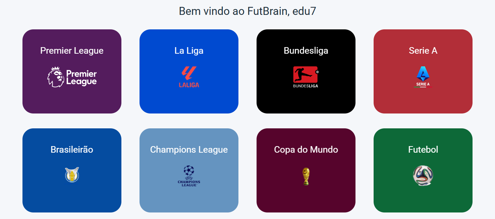

# FutBrain ⚽🧠  
Uma plataforma interativa de quizzes sobre futebol com dashboards de desempenho.

> Imagem da Página para escolher os quizzes - Eduardo Almeida



## 📖 Sobre o Projeto

**FutBrain** é um website desenvolvido como projeto individual para a Faculdade **SPTech**. O objetivo é unir aprendizado e diversão, oferecendo quizzes sobre diversas ligas de futebol e visualizações interativas dos resultados por meio de dashboards.

Além disso, a plataforma conta com uma introdução à **história do futebol**, incentivando o conhecimento antes do desafio.

---

## 🚀 Funcionalidades

- Página inicial com introdução à história do futebol
- Cadastro e login de usuários
- Quizzes interativos sobre ligas de futebol (Premier League, Champions League, Copa do Mundo, entre outros)
- Dashboard com estatísticas de desempenho do usuário
- Gráficos interativos com uso da API **web-data-viz** (fornecida pela SPTech)

---

## 🛠️ Tecnologias Utilizadas

<div align="center">
  
  <br />
</div> 

## 📖 Instalação e Uso

1. Clone o repositório:
    ```bash
    git clone https://github.com/Edualm21/FutBrain
    ```

2. Entre no diretorio Site
   ```bash
    cd Site
    ```
3. Instale as Dependências
   ```bash
    npm i ou npm install
    ```
4. inicialize o Servidor Local - app.js
   ```bash
    npm start
    ```

## 🤝 Contribuidor

 - Eduardo Almeida [https://github.com/Edualm21]

## 📝 Licença

Esse projeto está sob licença. Veja o arquivo [LICENÇA](LICENSE.md) para mais detalhes.